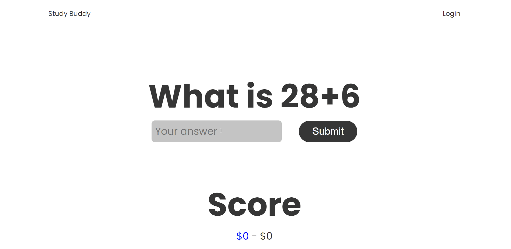

# Study Buddy

Study with your friends

Create your own flash cards and play with your friends

Devpost: https://devpost.com/software/study-buddy-sctz2l

Video: https://youtu.be/C60F0v4Xdq8

Demo link: [calgary-heist.vercel.app/](https://calgary-heist.vercel.app/)

## Demo

## Tools

* elm
* firebase
* figma

## Use

First install create-elm-app globally by doing `npm install create-elm-app -g`

To start do `elm-app start`

## Team

🅱oolean 🅱ois

## License

 
